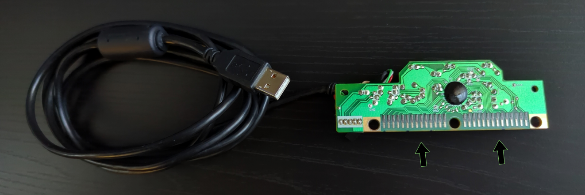
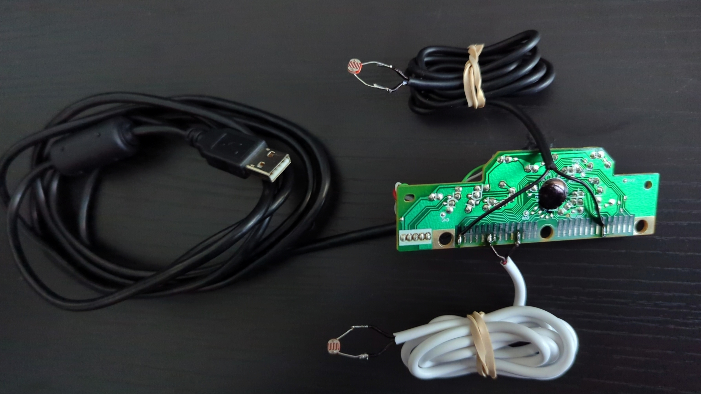
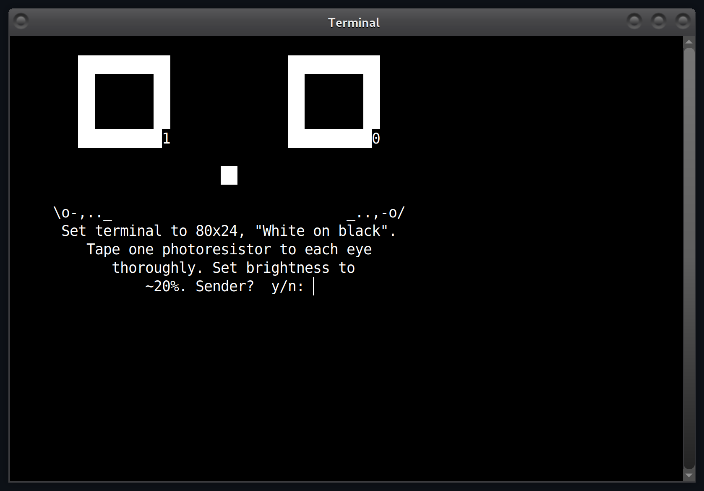
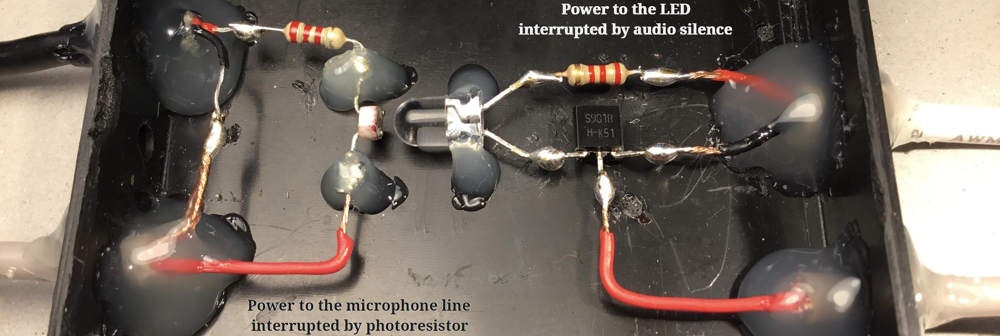
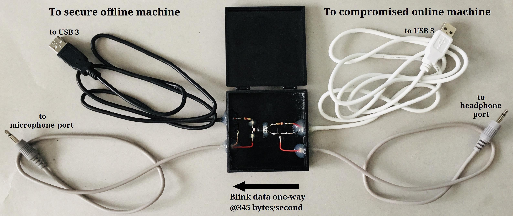
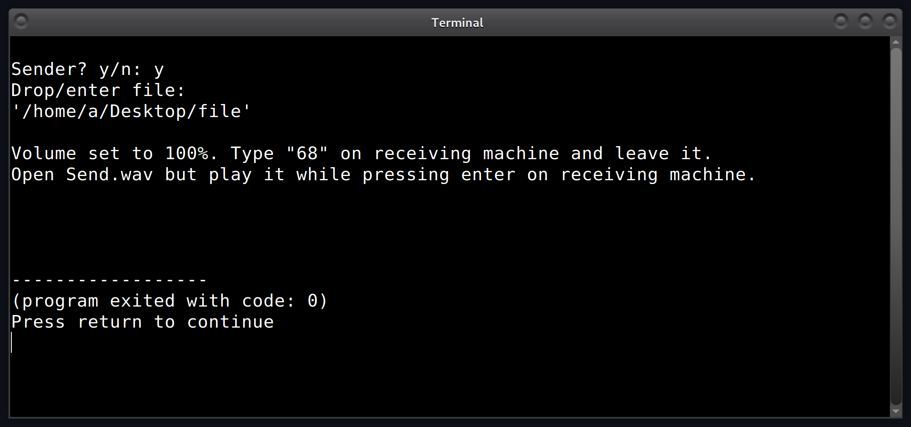
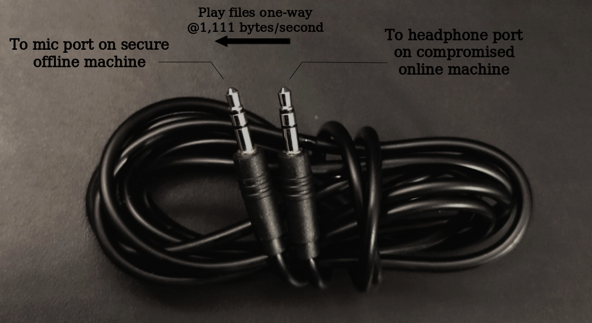

### Run it

```apt install g++ geany```. Open the .cpp in Geany. Hit F9 once. F5 to run.

<br>

https://github.com/compromise-evident/airgapFTP/assets/75550631/cabe9cfb-08b6-44af-8240-1c76162d4c3f

<br>

### :hocho: Gut a keyboard & sand off black coating

<p align="center">
  
</p>

<br>

### Solder photoresistors to leads who type if shorted

<p align="center">
  
</p>

<br>

### Tape photoresistors to eyes of the sending machine

<p align="center">
  
</p>

<br>

### Or 345B/s (press enter & play wav at the same time)

This method proves that modern generic photoresistors are
sensitive to at least 5,520 adjustments in brightness per second
(an opposite bit is appended to each data bit to keep
the LED brightness normalized.) The bottleneck is the LED;
it cannot become darker fast enough after each flash of light.

<p align="center">
  
</p>

<p align="center">
  
</p>

https://github.com/compromise-evident/airgapFTP/assets/75550631/4a9a4f20-4205-4f49-96c6-10445f4c7c2d

<p align="center">
  
</p>

See [LED.cpp](https://github.com/compromise-evident/airgapFTP/blob/main/docs/LED/LED.cpp). (May need to tilt photoresistor away as in video above. Use it in a dark enclosure.) <br>
<sub>*Receiving machine must have audio recording hardware at least like that of the Dell Latitude E5500 (made in 2008.) <br>
If you own a modern thousand-dollar laptop, this won't work; your mic line is always noisy, even when disabled.<sub/>

<br>

### Or 1kB/s (press enter & play wav at the same time)

<p align="center">
  
</p>

<p align="center">
  
</p>

See [aux.cpp](https://github.com/compromise-evident/airgapFTP/blob/main/docs/aux/aux.cpp) <br>
<sub>*Receiving machine must have audio recording hardware at least like that of the Dell Latitude E5500 (made in 2008.) <br>
If you own a modern thousand-dollar laptop, this won't work; your mic line is always noisy, even when disabled.<sub/>

<br>

### Or truly instant NAS (no systemd)

https://github.com/compromise-evident/what-not/blob/main/truly_instant_NAS

<br>

### Send files to sending machine via local network.

* Sending machine should have the Gnome desktop environment, unfortunately.
  Go to Settings, Sharing. Enable sharing, then enable
  "File Sharing" without password. This creates a "Public"
  folder in /home/user/ if missing.
* Sending machine should run these tools in a new folder in /home/user/Public.
* Now any machine on that network has read / write access
  to that "Public" folder. Find it in your files browser
  in "Browse Network" or "Other Locations" and keep dropping files in folder "Send".

<br>

### DIY

https://github.com/compromise-evident/what-not/blob/main/process_file_by_bits.cpp

<br>

### Appendix

airgapFTP has been written about on
[HACKADAY](https://hackaday.com/2024/03/19/photoresistors-provide-air-gap-data-transfer-slowly/). Thank you for the recognition.
